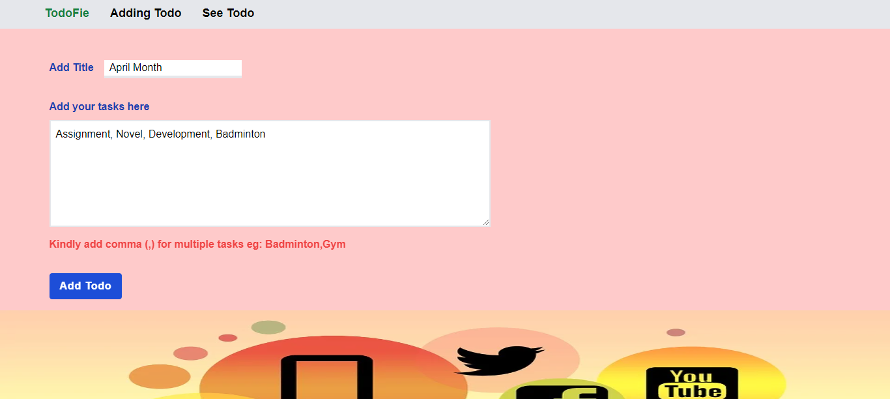

## Todo Fie - Complete your goals

## Hello Everyone
- This is my first full-stack project. 
-Todo Fie is a todo application built using following technologies Mongo DB, Expresss JS, React JS, Node JS, Tailwind CSS.
- This application provide CRUD operation to Todo.

### Hero you can see it live
- [Click Here](https://todo-mern-3945.netlify.app/)

 User Authentication, Time Stamps

### 💟 Shout out to wonderful mentor [Hitesh Choudhary](https://github.com/hiteshchoudhary) and [Anurag Tiwari](https://github.com/anuragtiwarime)  💟

## About Developer 👨‍💻
Hey I am Akshun Verma.  Fullstack Javascript Developer from Delhi. Very much eager to explore and develop scalable, user friendly, robust applications. 

  - [Instagram](https://www.instagram.com/akshunn_3945/)
   - [LinkedIn](https://www.linkedin.com/in/akshun-verma-98110b214/)

#### Do reach out and provide your valuable insights about the project. I appreciate your inputs.
#### Do reach out if you have any project idea let's work together and achieve goals.

### Machine requirements to run this project 🎯
- Node Js
- MondoDB Compass

## Steps to run the project in your machine 🪜

- Download the project locally
- Unzip the folder
-Open the unzipped folder in VSCode
- Click on backend folder
- Rename sample.env to .env
- Open the .env file
- Provide value to PORT variable (My suggestion: 4000)
- Provide value tp MONGODB_URL variable 
- Open new terminal to run server
- Run command 1: cd backend (If your terminal is not in this directory)
- Run command 2: npm install
- Run command 3: npm start
- Now open frontend folder
- If you have entered different value for PORT variable in backend folder > .env file, Update package.json file in frontend folder.
  - Open package.json look for proxy update :4000 value in the proxy value to the value you provided in .env
  - For example:
Port=5000 (.env file backend folder)
proxy:"https://localhost:5000" (package.json file frontend folder)
- Open a new terminal to run frontend
- Run command 1: cd frontend (If your terminal is not in this directory)
- Run command 2: npm install
- Run command 3: npm start
If your webpage doesn't load hit this url in your browser: http://localhost:3000

### Here you go your application is up and running... 🎉

# Meta Information ⏳
- Time Taken: 7 days
- Upcoming Future Enhancement: User Authentication, Time Stamps

## Thanks for spending your valuable time on this project 😄

